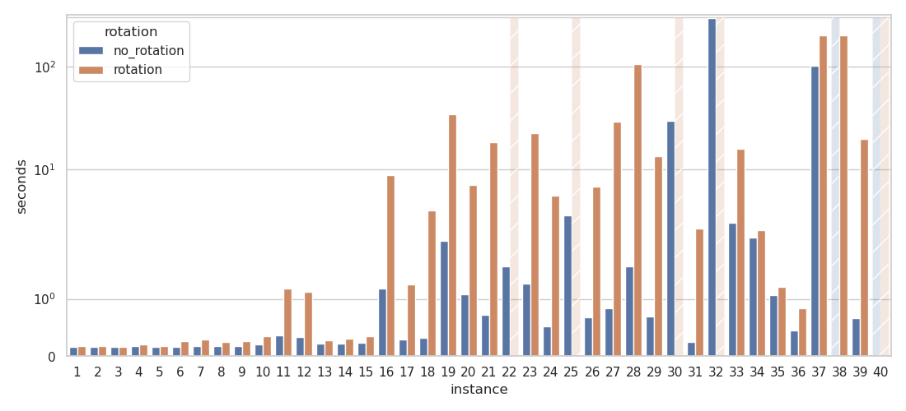

# Constraint Programming Formulation

### File Contents

The current working directory ```CP``` contains the following directories and files:
<pre>
* out                               (directory: output files)
* resources                         (directory: preprocessed data/instances)
* src                               (directory: source files)
    * cp_formulation.mzn                (Minizinc file: no rotation model)
    * cp_formulation_rotation.mzn       (Minizinc file: rotation model)
    * gather_data.py                    (Python file: script that runs experiments and saves results)
</pre>

### Usage

In order to reproduce the experiments one can open a terminal in the current working directory ```CP``` and run the
following command:

```shell
    python gather_data.py [-h] [-s {True, False}] [-p {True, False}] [-v {True, False}] [-si {int}] [-ei {int}]
```

| arg                    | meaning                                                                                   |
| ---------------------- | --------------------------------------------------------------------------------------------- |
| -h, --help             | show help message and exit                                                                    |
| -s, --Save             | allows to save time results in .csv file                                                      |                      |
| -p, --Plot             | plots the time results, from .csv files                                                       |
| -v, --Verbose          | prints execution time                                                                         |
| -si, --Start           | start instance number                                                                         |
| -ei, --End             | end instance number                                                                           |


### Input
The input data is in the format of .dzn files that can be found in the directory 
```resources```. All .dzn files have been properly preprocessed for efficiency reasons.
The following column representation shows how the input data is constructed in each .dzn files. 

|     |
|---|
|plate_width|
|num_chips|
|[chips_w[i] i in 0..num_chips - 1]|
|[chips_h[i] i in 0..num_chips - 1]|


### Output

*   #### .txt files

    The execution of the ```gather_data.py``` script will produce the results in the form of
    ```.txt``` files that will represent solution. Each file in the ```out``` directory follows the pattern below:

    |                             |                             |                                  |                                 |
    |:---------------------------:|:---------------------------:|:-------------------------------:|:-------------------------------:|
    |         plate_width         |      final_plate_hight      |                                 |                                 |
    |       num_chips       |                             |                                 |                                 |
    |          chip_w[0]          |          chip_h[0]          |          x_position[0]          |          y_position[0]          |
    |          chip_w[1]          |          chip_h[0]          |          x_position[1]          |          y_position[1]          |
    |             ...             |             ...             |               ...               |               ...               |
    | chip_w[num_chips - 1] | chip_h[num_chips - 1] | x_position[num_chips - 1] | y_position[num_chips - 1] |

*   #### Plots
    If the Plot option is given the ```gather_data.py``` script also produces a plot of the comparison in performance
    with respect to rotation or non rotation allowed:

    <p align='center'>
      
    </p>    