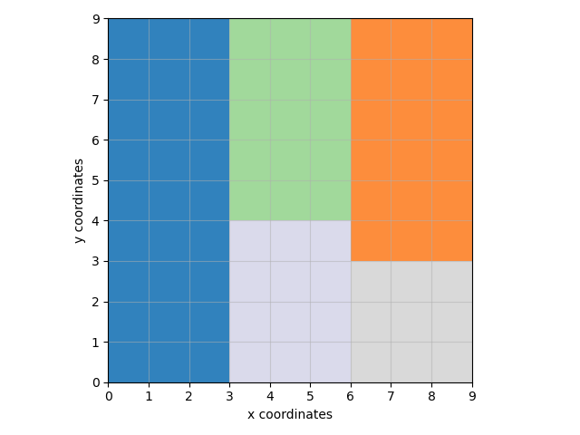
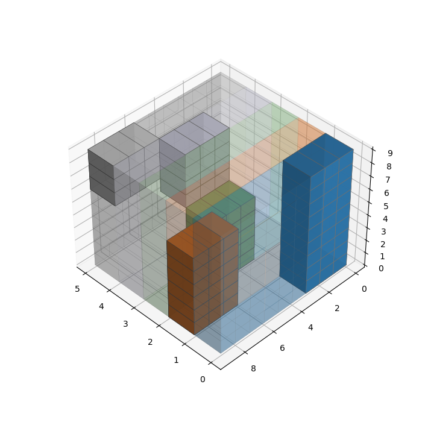

# SAT PROPOSAL

An alternative way of thinking formulated in SAT for the VLSI problem.
Please check the [FULL REPORT](../Full_Report.pdf) for details.

#### SAT solution for the 2nd instance:  

  

    

#### Visualization of the internal variables:  

  

    

